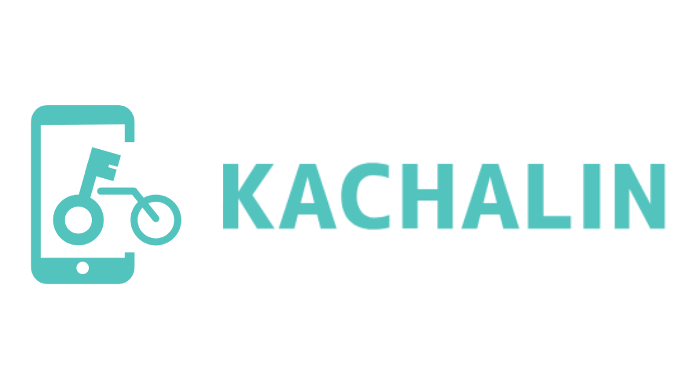
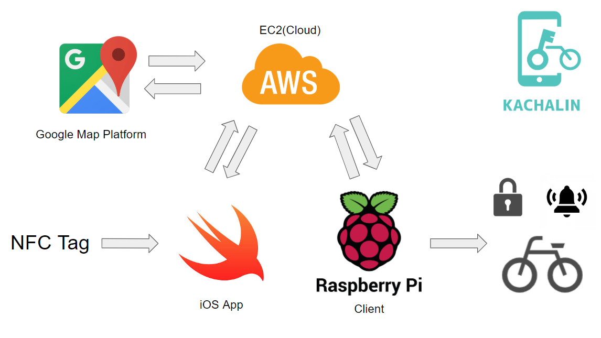
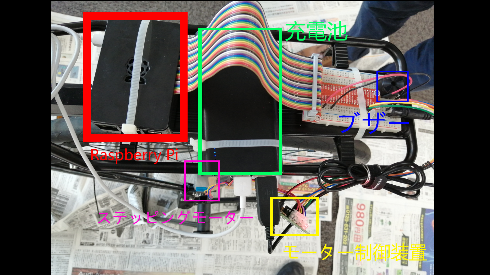
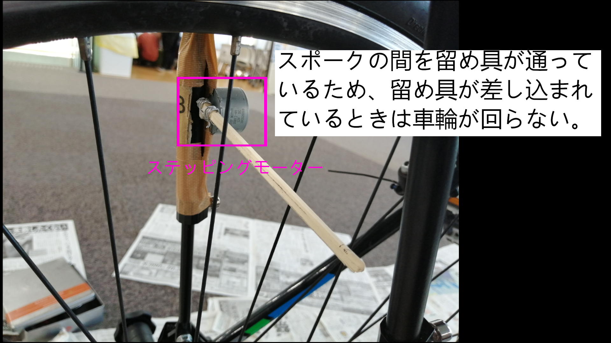

# KACHALIN

#### 注意：動画の修正
動画内のアーキテクチャは正しくは下のようになります．
FelicaではなくNFC Tagで，Google Map PlatformはEC2を経由しています．

## ネイティブアプリ開発のリポジトリ
https://github.com/jphacks/NG_1911_1

## 製品概要
### 自転車 X Tech

### 背景（製品開発のきっかけ、課題等）
- スマートフォンを操作しながらの自転車運転が社会問題になっている。
- 加えて、2020年に東京オリンピックが開催に伴い、訪日客が増えてレンタルサイクルの利用も増えることが想定される。土地勘のない人がスマートフォンで地図をみながら自転車を運転することを防止したい。

### 製品説明（具体的な製品の説明）
スマホのながら運転を防止するプロダクトを開発した。
開発するにあたり、ながら運転の定義を次のようにした。
1. スマホを片手で持ちながらの自転車運転
2. スマホを操作しながらの自転車運転

### 特長

#### 1. スマホを台座に置いて開錠することで、スマホを持ちながらの片手運転を防止

#### 2. 移動中、停止時以外でスマホの画面を操作するとビープ音による警告

#### 3. 移動中、音声による道案内で土地勘のない人でも自転車運転に集中可能

### 利用の流れ

#### 乗車時
- KACHALINを起動し、スマホを台座にセット
- NFC技術によってスマホが台座にセットされたことを検知して、自転車を開錠。
- 必要ならば、目的地の設定し、音声案内の開始（スキップも可）

#### 乗車中
- 走行中は、画面に余計な情報が表示されないため、運転に集中できる
- 走行中に別のアプリを使おうとしてKACHALINを閉じると、ビープ音による警告
- 音声による道案内に従って運転

#### 降車時
- 停止すると降りるボタンが表示されるので、ボタンを押して降車
- 自転車は自動で施錠
- スマホを台座から外して利用終了

### 解決出来ること
スマホを持ちながらの片手運転や走行中のスマホ操作、といった自転車の危険走を解決できる。
2020年の東京オリンピック開催に伴い、外国人や土地勘のない人でも、音声案内によって安全に走行できる。
その結果、交通事故の防止や安全運転の普及に繋がる。

### 今後の展望
今後は下記のことを改善していく。
- 施錠部分のの強化・改善
- 音声案内の精度向上
- 複数台の自転車に対応できるシステム構築

サービスとして以下の展望が考えられる。
- 決済機能を導入することで、2020年東京オリンピック開催による訪日客の増加や認知の広まりに伴い需要が増すレンタルサイクル市場に参入。レンタルサイクルから自転車の安全運転推進に携わる。
- 保護者が子どもの自転車を購入時に取り付けることにより、子どものながら運転を強制的に防ぐ。

## 開発内容・開発技術
### 活用した技術
#### API・データ
* Directions API(Google Maps Platform)

#### フレームワーク・ライブラリ・モジュール
* Express(node.js)
* Alamofire(swift)
* SwiftyJSON(swift)

#### デバイス
* RaspberryPI
* NFC Tag

### 研究内容・事前開発プロダクト（任意）
* なし

自転車の用意および利用するデバイスの購入のみ行った．

### 独自開発技術（Hack Dayで開発したもの）
#### 2日間に開発した独自の機能・技術

#### IoT (RaspberryPI)
httpクライアントアプリケーション（鍵部分）の開発
* GPIOピンでのステッピングモーターの制御
* GPIOピンでのブザーの並列制御
* 実際に自転車への鍵とブザーの取り付け

#### Cloud server (Amazon Web Services EC2)
自転車の状態の管理サーバーのバックエンドおよびインフラの整備
* AWS EC2でのデプロイ(nginx)
* 鍵の状態を変更するAPI
* ブザーが発音しているかの状態を変更するAPI
* Google APIからルート情報を取得するAPI

#### iOS app
自転車の鍵としての役割とながら運転を防止する機能の実装
* NFC Tagのリード機能
* 使いやすく親しみやすいデザイン設計と実装
* 目的地設定と音声による案内
* ユーザーがながら運転をしてるかどうかの判定機能
* 自転車の鍵としての役割の機能

##### 音声道案内機能の実装について
https://github.com/jphacks/NG_1911_1/blob/master/rejack/RideOnViewController.swift
上記のファイルの117行目から134行目で音声案内機能の主な実装を行なっている。
GPSの位置情報が更新された時に次の音声案内場所の付近に来た時にAPIから取得した案内文を音声再生するようにしている。
